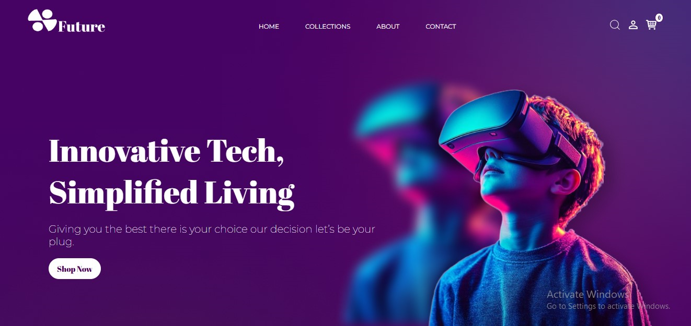

# Project Title: FUTURE

<h3>📸 Screenshots</h3>

  

## Description

Welcome to Future, the ultimate destination for gadget enthusiasts and tech aficionados! Our e-commerce platform is designed to provide a seamless shopping experience, showcasing a curated selection of the latest gadgets and electronics to meet all your tech needs.

## Frontend Technology Stack

- React(vite) 
- Vanilla CSS
- Javascript

## Features

1. Wide Selection: From smartphones and laptops to smart home devices and accessories, Future offers a diverse range of products to cater to every tech-savvy shopper.

2. User-Friendly Interface: Our intuitive design ensures that you can effortlessly browse, compare, and purchase products with just a few clicks.

3. Secure Shopping: Shop with confidence knowing that your personal information and transactions are protected with top-notch security measures.

4. Customer Reviews: Make informed decisions with authentic reviews from fellow customers. Share your experiences and help others find the best products.

5. Fast Shipping: Enjoy swift delivery services that ensure your gadgets reach you in no time.

6. Customer Support: Our dedicated support team is available to assist you with any inquiries, product recommendations, or issues you may encounter.

## Contact

 - [succhycomic@gmail.com](succhycomic@gmail.com)
